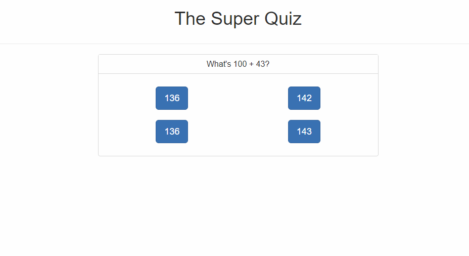

# WEB 2630 Exercise 7
> For this assignment, you will be adding a flip-in animation to an already created app. The app is a small quizzing tool that asks math problems. When you get a question wrong an alert will show up saying it was wrong but if you get the question right the component will flip and show a correct answer component. Your goal is to create an animation when the user gets the correct answer, you will be able to achieve this by following the example from class and following along with all the ToDo comments within the starter file.You only need to make adjustments to App.vueFollow along with the ToDo comments to achieve the final outcome. * Note: there is a lot of code provided, from this point in class you should understand how all this works.

## Exercise Steps

1. Create WEB2630_Exercise7 Repository on GitHub
    * Note: Make Repository Private
2. Open Terminal or Command Prompt
    1. Clone Template
        * git clone --bare https://github.com/CodySquadroni/WEB2630_Exercise7
            * Note: Make sure to 'cd' to a directory you want it downloaded to.
    2. cd Into WEB2630_Exercise7.git
    3. Copy Template Into Your Repository
        * git push --mirror https://github.com/GITHUB_USERNAME/WEB2630_Exercise7
            * Note: Make sure to put your GitHub Username in place of GITHUB_USERNAME
    4. Remove Copy WEB2630_Exercise7.git
    5. Clone Your GitHub Repository
        * git clone https://github.com/GITHUB_USERNAME/WEB2630_Exercise7
3. Complete ToDo Comments in App.vue
4. Connect WEB2630_Exercise7 to Netlify
5. Submit Your GitHub and Netlify URL on Canvas

**Note: Remember to make your GitHub repository private and add me as a collaborator GitHub username: CodySquadroni**

## Final Outcome



# Commands
## Project setup
```
npm install
```

### Compiles and hot-reloads for development
```
npm run serve
```

### Compiles and minifies for production
```
npm run build
```

### Run your tests
```
npm run test
```

### Lints and fixes files
```
npm run lint
```

### Customize configuration
See [Configuration Reference](https://cli.vuejs.org/config/).
